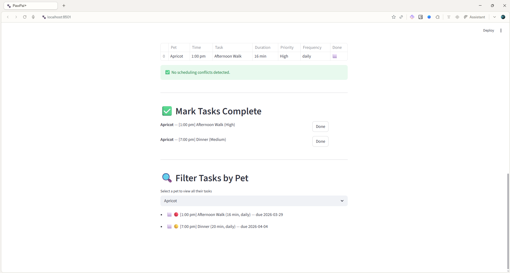

# 🐾 PawPal+ (Module 2 Project)

PawPal+ is a smart pet care scheduling app built with Python and Streamlit. It helps busy pet owners organize daily care tasks for their pets — including feedings, walks, medications, and vet appointments — using algorithmic logic to sort, filter, and detect scheduling conflicts.

---

## 📸 Demo



---

## 🎯 Features

- **Owner & Pet Management** — Create an owner profile and add multiple pets with name, species, and age.
- **Task Scheduling** — Add tasks to each pet with a description, time, duration, priority, frequency, and due date.
- **Sorting by Priority** — Today's schedule is automatically sorted by priority (High → Medium → Low), then by time.
- **Sorting by Time** — Tasks can also be sorted chronologically by their scheduled time (HH:MM).
- **Conflict Detection** — The scheduler warns you if two tasks for the same pet are scheduled at the same time.
- **Recurring Tasks** — Daily and weekly tasks automatically reschedule themselves for the next occurrence when marked complete.
- **Filter by Pet** — View all tasks for a specific pet.
- **Filter by Status** — View only pending or completed tasks across all pets.
- **Mark Tasks Complete** — Mark individual tasks as done directly from the UI.

---

## 🧠 Smarter Scheduling

The `Scheduler` class provides intelligent task management:

- **`sort_by_priority()`** sorts tasks using a High → Medium → Low priority order, breaking ties by time. This ensures the most important tasks are always seen first.
- **`sort_by_time()`** sorts tasks chronologically using Python's `sorted()` with a lambda key on the `HH:MM` time string.
- **`detect_conflicts()`** scans each pet's task list for duplicate scheduled times and returns human-readable warning strings rather than crashing.
- **`mark_task_complete()`** calls `task.mark_complete()` which uses Python's `timedelta` to calculate the next due date for daily (+1 day) and weekly (+7 days) recurring tasks.

---

## 🏗️ System Architecture

The app is built around four core classes in `pawpal_system.py`:

| Class | Responsibility |
|---|---|
| `Task` | Stores task details (description, time, duration, priority, frequency, due date, completion status) |
| `Pet` | Holds a pet's info and its list of tasks |
| `Owner` | Manages multiple pets and provides access to all their tasks |
| `Scheduler` | The brain — sorts, filters, detects conflicts, and manages recurring tasks |

---

## 🚀 Getting Started

### Setup

```bash
git clone https://github.com/summer-waves/ai110-module2show-pawpal-starter.git
cd ai110-module2show-pawpal-starter
pip install -r requirements.txt
```

### Run the CLI demo

```bash
python main.py
```

### Run the Streamlit app

```bash
streamlit run app.py
```

---

## 🧪 Testing PawPal+

Run the full automated test suite with:

```bash
python -m pytest
```

### What the tests cover

- **Task completion** — Verifies `mark_complete()` sets `completed = True`
- **Task addition** — Verifies adding a task increases a pet's task count
- **Sorting correctness** — Verifies tasks are returned in chronological order
- **Priority sorting** — Verifies High priority tasks appear before Medium and Low
- **Daily recurrence** — Verifies completing a daily task creates a new task due tomorrow
- **Once recurrence** — Verifies completing a "once" task does NOT add a new task
- **Conflict detection** — Verifies the scheduler flags two tasks at the same time
- **No false conflicts** — Verifies tasks at different times produce zero warnings
- **Empty schedule** — Verifies an owner with no pets returns an empty schedule
- **Filter by pet** — Verifies filtering by pet name returns only that pet's tasks

### Confidence Level: ⭐⭐⭐⭐⭐ (5/5)

All 10 tests pass. Core scheduling behaviors — sorting, recurrence, and conflict detection — are fully verified.

---

## 📁 Project Structure

```
ai110-module2show-pawpal-starter/
├── app.py               # Streamlit UI
├── main.py              # CLI demo script
├── pawpal_system.py     # Core backend classes
├── requirements.txt     # Dependencies
├── reflection.md        # Project reflection
└── tests/
    └── test_pawpal.py   # Automated test suite
```

---

## 🛠️ Built With

- [Python 3.11](https://www.python.org/)
- [Streamlit](https://streamlit.io/)
- [pytest](https://pytest.org/)
